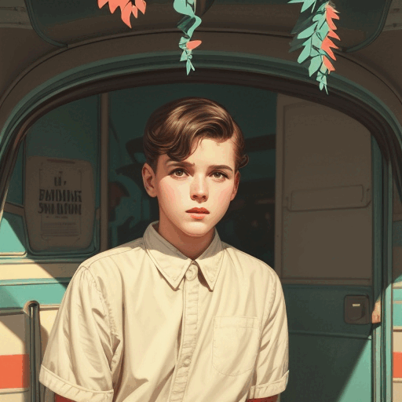
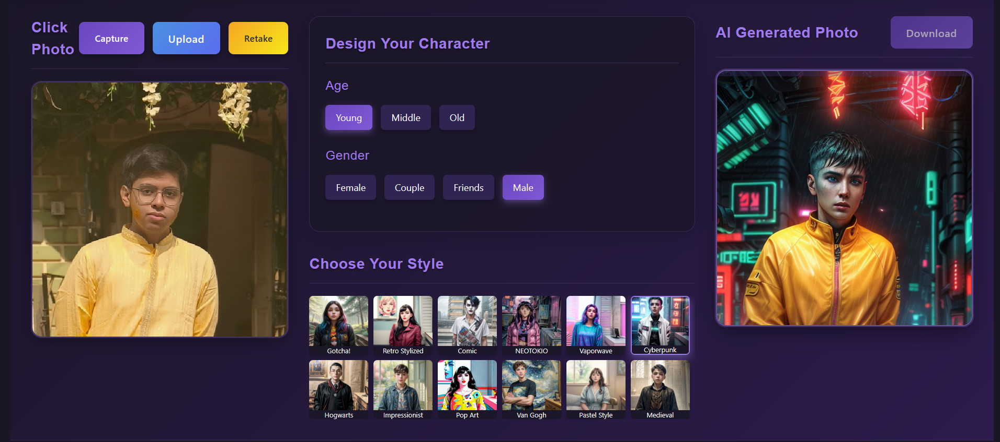

<h1 align="center">AI Photo Booth</h1>
<p align="center">
    Transform photos into artistic portraits using Stable Diffusion<br>
    Take a photo and let AI create personalized Indian-styled artwork!
</p>

# Project Name

<div align="center">
  
  <br/>
  
</div>

## Description

This AI Photo Booth application transforms photos into various artistic styles while maintaining Indian features and characteristics. It uses Stable Diffusion with ControlNet for accurate pose and feature preservation.

## Overview

## Requirements

1. **GPU Server Requirements:**
   - NVIDIA GPU (RTX 4070 Ti or better recommended)
   - [Stable Diffusion WebUI](https://github.com/AUTOMATIC1111/stable-diffusion-webui) installed
   - ControlNet extension
   - Required models (see Models section)

2. **Client Requirements:**
   - Webcam
   - Modern web browser (Firefox recommended)
   - Node.js and Yarn installed

## Installation

### 1. Stable Diffusion WebUI Setup

1. Install Stable Diffusion WebUI:
   ```bash
   git clone https://github.com/AUTOMATIC1111/stable-diffusion-webui
   cd stable-diffusion-webui
   ```

2. Enable API access by adding to `webui-user.sh`:
   ```bash
   export COMMANDLINE_ARGS="--api --listen"
   ```

3. Install ControlNet extension:
   - Open WebUI
   - Go to Extensions > Install from URL
   - Enter: `https://github.com/Mikubill/sd-webui-controlnet.git`
   - Click Install

4. Increase ControlNet cache:
   - Go to Settings > ControlNet
   - Set "Model cache size" to higher value (e.g., 5)
   - Click Apply Settings

### 2. Frontend Setup

1. Clone this repository:
   ```bash
   git clone [your-repo-url]
   cd ai-photo-booth
   ```

2. Install dependencies:
   ```bash
   yarn install
   ```

3. Configure the application:
   - Update `vite.config.ts` with your Stable Diffusion WebUI API URL
   - Update `App.vue` with your fileserver URL

4. Start the development server:
   ```bash
   yarn dev
   ```

### 3. File Server Setup

1. Create uploads directory:
   ```bash
   mkdir uploads
   ```

2. Run the fileserver:
   ```bash
   python fileserver/fileserver.py uploads -H "http://localhost:8000"
   ```

## Running in Production

For a production setup, run Firefox in kiosk mode:
```bash
firefox -kiosk http://localhost:5173/
```

## Features

- Multiple artistic styles including:
  - Clay Figure
  - Anime
  - Watercolor
  - Sci-Fi
  - Marble Sculpture
  - and more!
- Indian-specific features and characteristics
- Real-time photo capture
- QR code sharing
- Progress visualization
- Keyboard shortcuts (Shift-S for capture)

## Models Required

Download these models from [Civitai](https://civitai.com/) or [Hugging Face](https://huggingface.co/):

1. Base Models:
   - dreamshaper8Pruned.hz5Q.safetensors
   - absolutereality181.n8IR.safetensors
   - animepasteldreamSoft.lTTK.safetensors
   - (See models.md for complete list)

2. ControlNet Models:
   - control_v11p_sd15_openpose
   - control_v11f1p_sd15_depth
   - control_v11p_sd15_softedge

## Troubleshooting

- If images aren't saving:
  - Check fileserver permissions
  - Verify upload directory exists
  - Check network connectivity
  - Review browser console for errors

- If generation is slow:
  - Verify GPU is being utilized
  - Check ControlNet cache settings
  - Reduce resolution if needed
